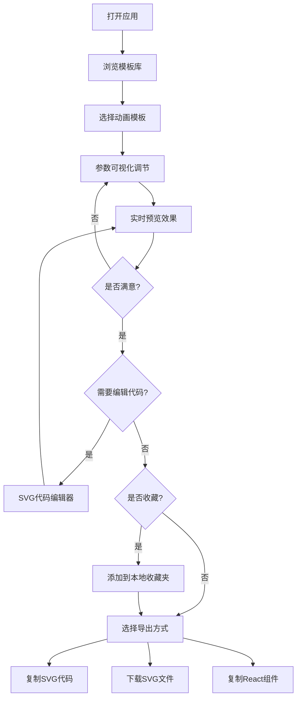

## 1. 产品概述

SVG加载动画可视化生成器，一款面向前端开发者和设计师的纯前端工具，帮助用户快速生成、定制和导出可直接使用的SVG加载动画代码，无需复杂的动画编码即可创建精美的加载效果。

- **核心价值**：降低SVG动画制作门槛，提供即开即用的模板库，支持可视化参数调节和实时预览
- **目标用户**：前端开发者、UI设计师、产品经理
- **市场定位**：专注于加载动画领域的轻量化在线工具，填补通用设计工具在加载动画快速生成上的空白

## 2. 核心功能

### 2.1 功能模块

1. **首页**：模板库展示、实时预览区、参数调节面板、代码编辑器
2. **模板库**：20+精选SVG加载动画模板，分类展示（环形、点阵、脉冲、故障风、像素方块等）
3. **参数调节**：可视化控制面板，支持多维度参数实时调整
4. **代码编辑**：SVG原始代码编辑器，支持双向实时同步
5. **导出中心**：多种导出格式支持
6. **收藏夹**：本地收藏管理，快速访问常用模板

### 2.2 页面详情

| 页面名称 | 模块名称 | 功能描述 |
|-----------|-------------|---------------------|
| 首页 | 顶部导航栏 | Logo、功能切换（模板/收藏）、主题切换、GitHub链接 |
| 首页 | 模板库面板 | 模板分类标签、模板网格展示、模板搜索、模板预览缩略图 |
| 首页 | 预览区域 | 动画实时预览、背景切换（白/黑）、加载场景模拟、尺寸显示 |
| 首页 | 参数调节面板 | 滑块控制（尺寸、时长、线宽）、颜色选择器、循环次数、缓动函数下拉选择、重置按钮 |
| 首页 | 代码编辑器 | SVG代码实时编辑、语法高亮、代码格式化、错误提示 |
| 首页 | 导出工具栏 | 复制SVG代码、下载SVG文件、复制React组件、一键复制提示 |
| 收藏夹 | 收藏列表 | 已收藏模板展示、取消收藏、快速应用 |

## 3. 核心流程

## 4. 用户界面设计

### 4.1 设计风格

- **主色调**：深海蓝 `#0ea5e9` 作为主色，搭配紫罗兰 `#8b5cf6` 作为强调色，营造科技感和创造力
- **背景**：深色主题为主，使用深蓝渐变背景配合微妙的网格纹理，增强沉浸感
- **辅助色**：翡翠绿 `#10b981` 表示成功状态，琥珀橙 `#f59e0b` 表示警告
- **字体**：标题使用 Space Grotesk，正文使用 JetBrains Mono（代码区）和 Inter（界面）
- **按钮风格**：圆角8px，微妙悬停动效，点击反馈清晰
- **卡片风格**：毛玻璃效果（backdrop-filter: blur），半透明背景，柔和阴影
- **整体调性**：现代、专业、富有科技感，同时保持简洁易用

### 4.2 页面设计概览

| 页面名称 | 模块名称 | UI元素 |
|-----------|-------------|-------------|
| 首页 | 顶部导航 | 左侧Logo（SVG动画图标+文字），右侧功能切换按钮组，主题切换开关 |
| 首页 | 模板库 | 分类标签栏（横向滚动），网格布局卡片（悬停放大+光晕效果），选中态高亮边框 |
| 首页 | 预览区 | 居中显示，自适应容器，背景切换按钮组（白/黑/棋盘格），模拟加载文字 |
| 首页 | 参数面板 | 分组折叠面板，滑块带实时数值显示，颜色选择器带预设调色板 |
| 首页 | 代码区 | 深色代码编辑器背景，行号显示，语法高亮，工具栏固定在顶部 |
| 首页 | 导出栏 | 三个并排按钮，带图标和文字，点击后显示成功Toast提示 |

### 4.3 响应式设计

- **桌面端**（>1280px）：三栏布局（模板库 | 预览区 | 参数+代码）
- **平板端**（768px-1280px）：两栏布局（模板库折叠为侧边栏 | 预览+参数+代码垂直堆叠）
- **移动端**（<768px）：单栏流式布局，使用Tab切换不同功能模块

### 4.4 动画与交互

- 页面加载：元素错落入场动画（staggered reveal）
- 模板选择：平滑过渡动画，选中模板有脉冲光晕
- 参数调节：实时预览无卡顿，滑块拖动有阻尼感
- 复制导出：成功提示动画（缩放+淡入淡出）
- 悬停效果：所有可交互元素有明确的状态反馈（颜色、缩放、阴影变化）
