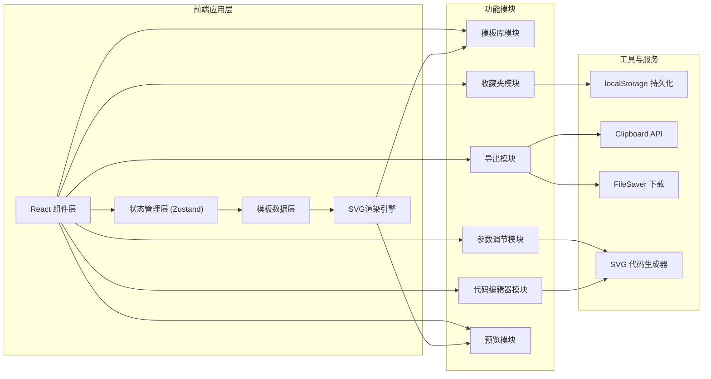

## 1. 架构设计



## 2. 技术栈描述

- **前端框架**: React@18 + TypeScript
- **构建工具**: Vite@5
- **状态管理**: Zustand@4
- **样式方案**: TailwindCSS@3
- **图标库**: lucide-react
- **代码编辑器**: @monaco-editor/react (轻量级代码编辑器)
- **动画支持**: 原生SVG + SMIL动画 + CSS keyframes
- **类型安全**: TypeScript strict模式

## 3. 项目结构

```
src/
├── components/          # 组件目录
│   ├── Header.tsx          # 顶部导航
│   ├── TemplateGallery.tsx # 模板库展示
│   ├── TemplateCard.tsx    # 单个模板卡片
│   ├── PreviewArea.tsx     # 预览区域
│   ├── ControlPanel.tsx    # 参数控制面板
│   ├── CodeEditor.tsx      # SVG代码编辑器
│   ├── ExportToolbar.tsx   # 导出工具栏
│   ├── FavoriteList.tsx    # 收藏夹列表
│   └── Toast.tsx           # 提示组件
├── hooks/               # 自定义Hooks
│   ├── useLocalStorage.ts  # 本地存储Hook
│   ├── useClipboard.ts     # 剪贴板Hook
│   └── useToast.ts         # Toast提示Hook
├── store/               # 状态管理
│   └── useAppStore.ts      # 应用全局状态
├── templates/           # SVG模板库
│   ├── index.ts            # 模板导出
│   ├── circular.ts         # 环形动画模板
│   ├── dots.ts             # 点阵动画模板
│   ├── pulse.ts            # 脉冲动画模板
│   ├── glitch.ts           # 故障风模板
│   └── pixel.ts            # 像素方块模板
├── utils/               # 工具函数
│   ├── svgGenerator.ts     # SVG代码生成
│   ├── svgParser.ts        # SVG代码解析
│   ├── exporter.ts         # 导出功能
│   └── easingFunctions.ts  # 缓动函数
├── types/               # 类型定义
│   └── index.ts            # 全局类型
├── App.tsx              # 根组件
├── main.tsx             # 入口文件
└── index.css            # 全局样式
```

## 4. 核心数据模型

### 4.1 模板类型定义

```typescript
interface SVGAnimationTemplate {
  id: string;
  name: string;
  category: 'circular' | 'dots' | 'pulse' | 'glitch' | 'pixel' | 'other';
  description: string;
  defaultParams: AnimationParams;
  generate: (params: AnimationParams) => string;
  thumbnail: string;
}

interface AnimationParams {
  size: number;           // 尺寸 20-200
  duration: number;       // 动画时长 0.3-5s
  strokeWidth: number;    // 线条粗细 1-10
  color: string;          // 主颜色
  colorSecondary?: string;// 次要颜色
  loopCount: number;      // 循环次数 0=infinite, 1-10
  easing: string;         // 缓动函数
}

interface FavoriteItem {
  id: string;
  templateId: string;
  params: AnimationParams;
  name: string;
  createdAt: number;
}
```

## 5. 核心功能实现方案

### 5.1 SVG动画生成机制

每个模板为一个纯函数，接收参数后返回完整的SVG代码字符串。SVG内部使用SMIL动画（`<animate>`、`<animateTransform>`）或CSS keyframes实现动画效果。

### 5.2 双向同步机制

- 参数调节 → 实时生成SVG → 更新预览和代码编辑器
- 代码编辑 → 解析SVG → 提取参数 → 更新预览和参数面板（支持部分同步）

### 5.3 本地存储方案

使用localStorage存储收藏夹数据，key为 `svg-loader-favorites`，数据格式为JSON序列化的 `FavoriteItem[]`。

### 5.4 导出功能

1. **复制SVG代码**: 使用Clipboard API直接复制纯SVG字符串
2. **下载SVG文件**: 使用Blob API创建文件，触发a标签下载
3. **复制React组件**: 将SVG代码转换为React组件格式（转换属性名、处理样式）

## 6. 性能优化策略

1. 模板SVG生成使用memo缓存，参数未变化时不重新生成
2. 代码编辑器使用防抖处理，避免频繁解析
3. 预览区使用CSS `will-change: transform` 优化动画性能
4. 模板缩略图预生成，避免运行时重复渲染
